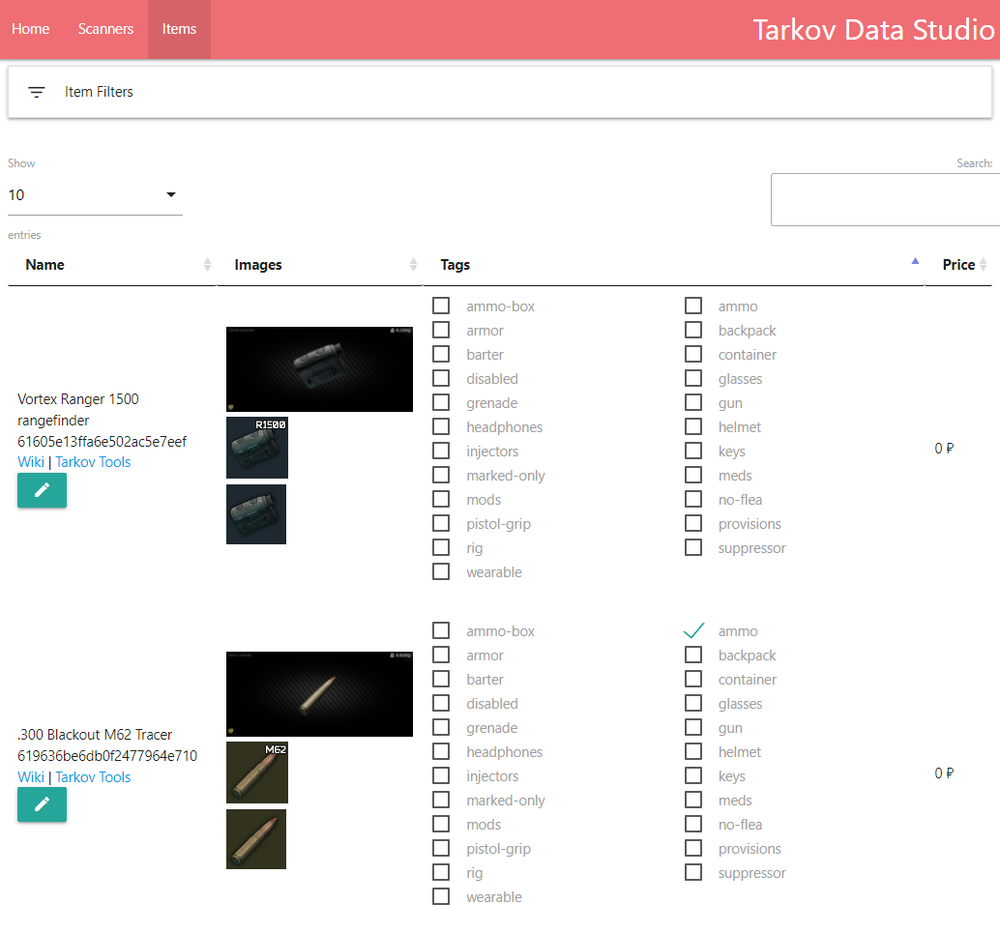

# Tarkov Data Manager 🛢️💻

The Tarkov Data Manager is a tool to manage the Tarkov game data collected by **scanners**.

It is a web application that allows you to do the following:

- Start, stop, and interact with scanners
- View the data collected by the scanners
- Make modifications to items or add missing images

## Components 🛠️

This repo contains two main components:

- The **Tarkov Data Manager** - Web application for managing Tarkov game data and scanners
- The **Tarkov Socket Server** - Service for sending commands to scanners and more

### Tarkov Data Manager

The Tarkov Data Manager can be run locally without Docker by running the following commands:

> This section is still under construction. We are working on creating a local environment to test the application locally with Docker and a mock instance of the database. Right now, developers connect to a testing branch of the prod database. Developers also need database credentials stored in `src/tarkov-data-manager/creds.env`.
> For active developers with database connections, you can run the following commands:

1. Enter the proper directory:

    ```bash
    cd src/tarkov-data-manager
    ```

1. Install dependencies:

    ```bash
    npm install
    ```

1. Run the application:

    ```bash
    npm run dev
    ```

### Example 📸



## Tarkov Socket Server 🔌

The Tarkov Socket Server can be started locally without Docker by running the following commands:

1. Enter the proper directory:

    ```bash
    cd src/tarkov-socket-server
    ```

1. Install dependencies:

    ```bash
    npm install
    ```

1. Run the application:

    ```bash
    npm run dev
    ```

## Running locally with Docker 🐳

> This is the suggested option for local development

First, edit the `src/tarkov-data-manager/creds.env` file to include your proper credentials.

> An example of this file can be found at [`src/tarkov-data-manager/creds.env.example`](src/tarkov-data-manager/creds.env.example).

Second, copy the fake ssl cert + key:

```bash
cp src/nginx/ssl-fake/* src/nginx/ssl/
```

You now have two options to start the docker-compose stack (both do the exact same thing):

- `make run`
- `docker-compose up --build`

Browse to your web app when it starts up [localhost:4000](http://localhost:4000).
